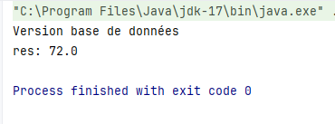
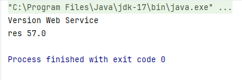

<h2>Injection de dépendences et Inversion de contrôle</h2>

<h3>Diagramme de classe</h3>

<h3>Captures d'écran</h3>

<h3>N.B :</h3>

Le fonctionnement de la présentation par XML nécessite le constructeur sans paramètres de MetierImpl (En Commentaire)
